# 3D Print Symptoms — Diagnosis & Mitigation

_Material rows: PLA · PETG · TPU. Slicer steps are Bambu Studio unless noted._
_Drop replacement images into `docs/images/` — filenames match the placeholder references below._

---

## 1. Corner Blobs / Bulging at Direction Changes

| Example | Material | Mitigation | Reason / Cause | Slicer How To |
|---------|----------|-----------|----------------|---------------|
| 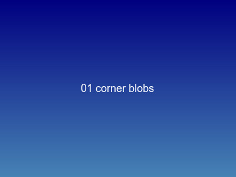 | **PLA** | Lower outer wall speed; enable Pressure Advance | Head decelerates at 90° corner → nozzle pressure builds up → blob deposited before direction change | 1. Filament → Pressure Advance: `0.04–0.08`  2. Quality → Outer wall speed: `40–50 mm/s`  3. Quality → Enable Arc Fitting (smooth corner paths)  4. Quality → Jerk: `8–10 mm/s`  5. Advanced → Smooth Speed Transition: ON |
| | **PETG** | Same as PLA but PA needs higher tuning; PETG is more viscous | Higher melt viscosity = more pressure lag; blobs larger and stickier | 1. Pressure Advance: `0.06–0.12`  2. Outer wall speed: `30–40 mm/s`  3. Jerk: `5–8 mm/s`  4. Arc Fitting: ON  5. Wipe Distance: `1–2 mm` on outer wall |
| | **TPU** | Use very low speed; disable PA or set near zero | Highly elastic filament — pressure advance model breaks down; PA overcorrects and starves the corner | 1. Pressure Advance: `0.0` (disable)  2. All speeds: `≤ 25 mm/s`  3. Jerk: `3–5 mm/s`  4. Retraction: OFF or `≤ 0.5 mm`  5. Combing: ON (eliminate travel blobs) |

---

## 2. Stringing / Oozing Between Moves

| Example | Material | Mitigation | Reason / Cause | Slicer How To |
|---------|----------|-----------|----------------|---------------|
|  | **PLA** | Retraction + combing; slight temp reduction; disable Z-hop | Low-viscosity melt oozes during travel when nozzle pressure isn't bled off. **Pro tip:** Z-hop acts like a plunger — it physically lifts molten PLA out of the nozzle into a string. Using continuous travel paths without Z-hop lets the nozzle self-wipe on infill instead. | 1. Retraction: `0.4–0.8 mm` (direct drive) / `4–6 mm` (Bowden)  2. Retraction speed: `35–45 mm/s`  3. Combing: ON (travel over infill only)  4. Reduce nozzle temp by `5–10°C`  5. Z-Hop type: **None** (Printer Profile → Extruder → Retraction → Z hop type) |
| | **PETG** | Maximize travel speed; Z-hop; don't over-retract | PETG is gooey — you can't stop it from oozing with retraction alone. **Pro tip:** You have to *outrun* the ooze. At `≥ 300 mm/s` travel, the filament snaps before a string has time to form mid-air. Lowering travel speed makes PETG stringing dramatically worse. | 1. Travel speed: `300–500 mm/s` (do NOT lower Bambu defaults)  2. Retraction: `0.8–1.2 mm` (direct) — don't go higher  3. Retraction speed: `25–35 mm/s` (slow — PETG tears)  4. Combing: ON  5. Min travel before retract: `3 mm` (avoid micro-retracts) |
| | **TPU** | Zero retraction; rely entirely on combing + avoid-crossing-walls | Flexible filament compresses in the Bowden tube — retraction stretches the TPU without actually pulling plastic back from the nozzle tip, then ruins pressure dynamics on restart. **Pro tip:** Set retraction to `0 mm` and enable "Avoid crossing walls" — the slicer routes travel through infill instead of open air. | 1. Retraction: **0 mm** (Filament Profile → Settings Override)  2. Enable "Avoid crossing walls" (Process Profile → Quality)  3. Combing: ALWAYS ON  4. Wipe distance: `3–5 mm` (longer wipe compensates)  5. Travel speed: `≤ 80 mm/s` (fast travel flings strings) |

---

## 3. Layer Delamination / Splitting

| Example | Material | Mitigation | Reason / Cause | Slicer How To |
|---------|----------|-----------|----------------|---------------|
| 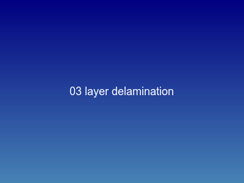 | **PLA** | Increase nozzle temp; reduce layer height; reduce speed | Insufficient heat transfer time between layers — cold layer surface can't reflow and bond to next deposit | 1. Nozzle temp: raise by `+5°C` incrementally  2. Layer height: reduce to `≤ 75%` of nozzle diameter  3. Print speed: reduce by `20%`  4. Fan speed: reduce to `50%` (more time for layer bonding)  5. Wall count: increase by 1 (more perimeter heat mass) |
| | **PETG** | Increase temp; reduce fan; PETG needs heat to bond — over-cooling is the #1 cause | PETG has a narrow reflow window; aggressive part cooling locks layers before they can fuse | 1. Nozzle temp: `235–245°C`  2. Fan: `≤ 30%` on perimeters (Bambu: set Part Cooling Fan speed)  3. First layer fan: OFF  4. Print speed: `≤ 60 mm/s` on walls  5. Avoid layer height `> 0.28 mm` — reduces overlap |
| | **TPU** | Print hotter; reduce speed significantly; layers flex apart under stress | Flexible layers spring back slightly on deposit, reducing contact area; compounded by any under-extrusion | 1. Nozzle temp: `+10°C` above nominal  2. Speed: `≤ 25 mm/s` all moves  3. Fan: `20–40%` only — full cooling prevents bonding  4. Flow rate: `+3–5%` (compensate for flex-back)  5. Line width: `+10%` of nozzle (wider bead = more overlap) |

---

## 4. Warping / Bed Adhesion Failure

| Example | Material | Mitigation | Reason / Cause | Slicer How To |
|---------|----------|-----------|----------------|---------------|
| 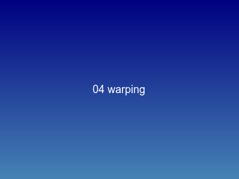 | **PLA** | PEI sheet; brim on large flat parts; no drafts | Differential cooling: top layers cool and contract faster than bed-adhered base → edges lift | 1. Bed temp: `55–65°C`  2. First layer speed: `≤ 20 mm/s`  3. Brim: `4–8 mm` on parts `> 80 mm` footprint  4. First layer flow: `+5%`  5. Enclosure: ON if available (eliminates drafts) |
| | **PETG** | Higher bed temp; avoid glass (too sticky — tears off layer); let part cool before removing | PETG contracts significantly on cooling; large parts warp even with good first-layer adhesion if ambient is cold | 1. Bed temp: `80–90°C`  2. Brim: `6–10 mm` for parts `> 60 mm` footprint  3. First layer height: `0.3 mm` (more squish)  4. Enclosure: ON — PETG is sensitive to drafts  5. Avoid fan for first `3 layers` |
| | **TPU** | Usually fine — flexible material conforms to bed; risk is the opposite (won't release) | TPU has very low shrinkage; warping is rare. Over-adhesion to PEI is the real risk — can tear the print | 1. Bed temp: `35–45°C` (lower than normal — reduces adhesion)  2. Apply glue stick to PEI as release agent  3. First layer speed: `≤ 15 mm/s`  4. Brim: usually not needed  5. Let bed fully cool to room temp before removing |

---

## 5. Elephant Foot (First Layer Squish-Out)

| Example | Material | Mitigation | Reason / Cause | Slicer How To |
|---------|----------|-----------|----------------|---------------|
| 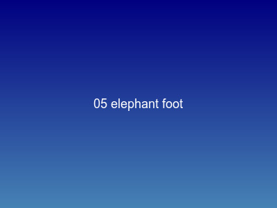 | **PLA** | Live Z adjust; reduce first layer flow | Nozzle too close to bed → excess plastic has nowhere to go → squishes outward → base wider than model | 1. Live adjust Z: raise by `+0.02–0.05 mm` incrementally  2. First layer flow: `95–98%`  3. First layer speed: reduce to `≤ 20 mm/s`  4. First layer height: `0.2 mm` (don't over-squish)  5. Elephant foot compensation: `0.1–0.2 mm` in Bambu Advanced |
| | **PETG** | More severe — PETG flows more under pressure; needs conservative Z offset | High melt flow index means PETG spreads further when over-squished; first layer accuracy directly affects snap/fit geometry | 1. Live adjust Z: raise `+0.05–0.1 mm` vs PLA baseline  2. First layer flow: `90–95%`  3. Elephant foot compensation: `0.15–0.25 mm`  4. First layer speed: `≤ 15 mm/s`  5. Verify with a calibration square before functional prints |
| | **TPU** | Very prone — flexible filament deforms under nozzle pressure | Soft material compresses both vertically and laterally; Z offset must be generous or base geometry is completely wrong | 1. Live adjust Z: `+0.1–0.15 mm` (most generous of all materials)  2. First layer flow: `90%`  3. First layer speed: `≤ 10 mm/s`  4. Elephant foot compensation: `0.2–0.3 mm`  5. Print a single-layer calibration square first — TPU is unforgiving |

---

## 6. Bridging Sag / Collapse

| Example | Material | Mitigation | Reason / Cause | Slicer How To |
|---------|----------|-----------|----------------|---------------|
|  | **PLA** | Full fan; reduce bridge speed; limit bridge length to `< 60 mm` | Bridge filament must solidify before gravity deflects it; fan quenches the bead mid-air before it droops | 1. Fan: `100%` during bridges  2. Bridge speed: `25–40 mm/s`  3. Bridge flow: `85–95%` (less pressure → less sag)  4. Bridge angle: slicer auto-detects best direction — verify it's correct  5. Design: add a chamfer or 45° approach to avoid bridges `> 50 mm` |
| | **PETG** | Moderate fan only — full fan causes delamination on next layer; keep bridges `< 40 mm` | PETG needs heat to bond layers, but bridges need cold to set — competing requirements; PETG bridges are inherently weaker | 1. Fan: `40–60%` during bridge only (Bambu: overhang fan speed)  2. Bridge speed: `20–30 mm/s`  3. Bridge flow: `80–90%`  4. Nozzle temp: reduce by `5°C` for bridge moves only (Bambu: custom G-code)  5. Design: 45° chamfer on all surfaces `> 30 mm` span — avoids the problem entirely |
| | **TPU** | Cannot bridge reliably — design around it | Flexible filament sags before it can solidify; surface tension is insufficient to hold a span; TPU bridges always fail beyond `10–15 mm` | 1. Fan: `80–100%` (as much as possible without delamination)  2. Bridge speed: `≤ 15 mm/s`  3. Bridge flow: `75–85%`  4. Use support for any span `> 15 mm` — no exceptions  5. Redesign: use 45° chamfers universally; TPU is not bridgeable |

---

## 7. Under-Extrusion / Gaps in Walls

| Example | Material | Mitigation | Reason / Cause | Slicer How To |
|---------|----------|-----------|----------------|---------------|
| 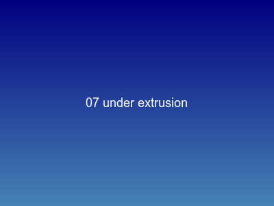 | **PLA** | Check for partial clog; calibrate flow; verify extrusion multiplier | Partial blockage, worn PTFE, temp too low for speed, or incorrect flow multiplier — slicer asks for more than the extruder delivers. **Heat creep pro tip:** If retraction is too long, you pull molten PLA up into the cold titanium heatbreak. It freezes to the walls and forms a semi-solid plug that chokes flow over time. | 1. Cold pull to clear partial clog **first** (heat to 250°C, push PLA, turn off heater, yank at 90°C — pulls out a nozzle-shaped carbon cast)  2. Run flow calibration (Bambu: Calibration → Flow Rate)  3. Temp: raise `+5°C`  4. Max volumetric speed: reduce to `12–15 mm³/s`  5. Retraction: keep `≤ 1 mm` direct drive to prevent heat creep |
| | **PETG** | Reduce speed more aggressively; PETG needs time to melt fully | PETG has high viscosity — the melt pool can't replenish fast enough at high speeds. **Extruder-skip pro tip:** If you push PETG faster than the hotend can melt it, pressure spikes and the steel extruder gear strips a groove into the filament side, slipping continuously while pushing nothing. | 1. Max volumetric speed: **`10 mm³/s`** (lower than PLA default)  2. Nozzle temp: `235–245°C` (or raise `+10°C` to melt faster)  3. Outer wall speed: `≤ 40 mm/s`  4. Flow calibration: PETG often needs `+3–5%` flow multiplier  5. Check for PTFE degradation if printing `> 240°C` regularly |
| | **TPU** | Bypass AMS entirely; use direct external spool; reduce speed | Flexible filament buckles in long Bowden tubes. **Slinky effect pro tip:** TPU acts like a spring — push 10mm at the extruder, the filament compresses inside 2 feet of PTFE, and only 4mm exits the nozzle. Feeding directly from a spool holder next to the printer eliminates the compression path. | 1. Unplug PTFE at the print head; feed TPU straight down from an external spool holder  2. Speed: `≤ 25 mm/s` all moves — no exceptions  3. Flow: `+5–10%` multiplier  4. Disable retraction or set `≤ 0.5 mm` (prevents buckling)  5. Direct drive extruder required — Bowden cannot reliably feed TPU |

---

## 8. Ghosting / Ringing (Vibration Ripples After Corners)

| Example | Material | Mitigation | Reason / Cause | Slicer How To |
|---------|----------|-----------|----------------|---------------|
|  | **PLA** | Enable input shaping; reduce acceleration; check for frame wobble | Print head direction change creates mechanical resonance → frame oscillates → ripple pattern appears in wall surface at fixed frequency from the corner | 1. Bambu: Calibration → Resonance Compensation (auto)  2. Acceleration: `≤ 3000 mm/s²` outer wall  3. Jerk: `7–10 mm/s`  4. Check belt tension (loose belt amplifies ringing)  5. Outer wall speed: `≤ 60 mm/s` |
| | **PETG** | Less prone than PLA — higher mass dampens resonance; still calibrate | PETG's heavier melt mass slightly damps oscillation; ghosting still occurs at high acceleration but amplitude is lower | 1. Resonance compensation: calibrate separately from PLA profile  2. Acceleration: `≤ 2500 mm/s²` outer wall  3. Jerk: `5–8 mm/s`  4. Outer wall speed: `≤ 50 mm/s`  5. If ghosting persists: check all eccentric nuts and linear rails |
| | **TPU** | Not a concern — flexible material absorbs all vibration | TPU's elasticity dissipates mechanical energy before it propagates to the wall surface; ghosting is physically impossible in soft materials | 1. No specific slicer tuning needed for ghosting  2. Focus instead on speed (≤ 25 mm/s) and pressure advance (off)  3. Acceleration can be low by default from speed limits  4. —  5. — |

---

## 9. Poor Overhang Quality / Drooping

| Example | Material | Mitigation | Reason / Cause | Slicer How To |
|---------|----------|-----------|----------------|---------------|
| 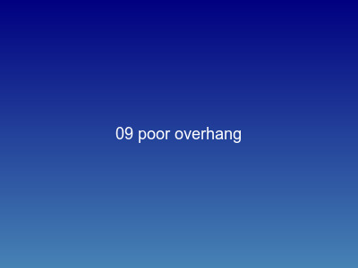 | **PLA** | Fan 100%; reduce overhang speed; keep overhangs `≤ 55°` from vertical | Overhang filament has no support below — must solidify by air cooling before gravity deflects it; beyond 55° material sags | 1. Fan: `100%` on overhang perimeters  2. Overhang speed threshold: `25–30°` from horizontal → reduce speed  3. Overhang speed: `20–30 mm/s`  4. Enable Overhang Fan Boost (Bambu Advanced)  5. Design: chamfer all edges — 45° is self-supporting by definition |
| | **PETG** | Reduced fan (delamination risk); overhangs `≤ 45°` only; chamfer aggressively | PETG needs cooling for overhangs but cooling degrades inter-layer bonding — the competing constraints mean PETG overhangs are worse than PLA | 1. Fan: `50–70%` on overhang perimeters only  2. Overhang speed: `15–25 mm/s`  3. Nozzle temp: reduce by `5°C` for overhang moves (reduces droop)  4. Design rule: chamfer all faces at 45° — PETG cannot do steep overhangs reliably  5. Max reliable overhang: `45°` — anything steeper needs support |
| | **TPU** | Support for anything over `30°`; design specifically for TPU | Soft material droops under its own weight — surface tension is insufficient; any overhang over 30° requires support or redesign | 1. Fan: `60–80%`  2. Speed: `≤ 20 mm/s` on overhangs  3. Support threshold: `30°` (vs 45° for rigid materials)  4. Support Z distance: `0.15–0.2 mm` (TPU support is hard to remove — keep distance generous)  5. Design around it: TPU functional parts should have no overhangs |

---

## 10. Dimensional Inaccuracy (Prints Too Tight / Too Loose for Snap Fits)

| Example | Material | Mitigation | Reason / Cause | Slicer How To |
|---------|----------|-----------|----------------|---------------|
| 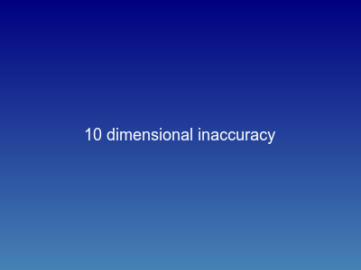 | **PLA** | XY hole compensation; calibrate flow; tune PA | Thermal expansion, first-layer squish, and extrusion width errors accumulate — holes print undersized, outer dims print oversized | 1. Bambu: Calibration → Flow Rate (correct volumetric accuracy)  2. Advanced → XY Hole Compensation: `+0.1–0.2 mm` (makes holes larger)  3. Advanced → XY Contour Compensation: `-0.05–0.1 mm` (shrinks outer walls)  4. Pressure Advance: calibrate accurately (PA errors directly affect line width)  5. Print a calibration cube + test fit before committing to functional prints |
| | **PETG** | Same calibration but PETG shrinks more on cooling — add more clearance to fit geometry | PETG's higher thermal expansion means printed parts are slightly smaller than the model after cooling — snap fits that work in PLA may be too tight in PETG | 1. XY Hole Compensation: `+0.15–0.25 mm`  2. XY Contour Compensation: `-0.1–0.15 mm`  3. Flow calibration: PETG often runs `+3–5%` actual vs set  4. For snap fits: add `0.1–0.2 mm` extra clearance vs PLA models  5. Fit profile in MasterTray Customizer: use **Loose** for first PETG print, then tighten |
| | **TPU** | Dimensions are meaningless without Shore hardness consideration — soft parts compress under measurement | TPU deforms under caliper pressure — a 2mm wall measures as 1.8mm. Fit tolerances must be wider. Over-extrusion also hides in soft material | 1. Flow: calibrate with a 0.4mm single-wall vase — measure wall thickness  2. XY Hole Compensation: `+0.3–0.5 mm` (TPU compresses into holes)  3. Fit profile: always use **Looser** in MasterTray — TPU fills gaps under load  4. Wall width: `+15%` line width (soft material needs more overlap to hit true dimension)  5. Measure parts under no load — caliper pressure causes false readings |

---

## 11. First Layer Failures (Not Sticking, or Permanently Bonded to Plate)

| Example | Material | Mitigation | Reason / Cause | Slicer How To |
|---------|----------|-----------|----------------|---------------|
| 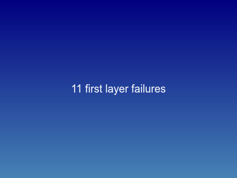 | **PLA** | Wash bed with hot water + Dawn dish soap, not just IPA | IPA dilutes and smears skin oils across the textured PEI surface without removing them. Dawn physically encapsulates oil molecules so they wash away. A contaminated plate feels clean but prints won't stick. | 1. Take PEI plate to sink; scrub with warm water, Dawn, and a non-abrasive sponge  2. Rinse completely; dry with a fresh paper towel  3. Do not touch the print area with bare fingers afterward  4. Bed temp: `55–65°C`  5. Repeat after every 5–10 prints on textured plates |
| | **PETG** | Apply Windex or glue stick as a *release agent* before printing | PETG bonds chemically to bare PEI and will pull chunks of metal off the build plate when cooling. Glue stick and Windex both leave a micro-film barrier — they're not used to improve adhesion, they're used to *prevent* permanent adhesion. | 1. Spray light coat of Windex onto a cold PEI plate; wipe with a paper towel  2. Let dry completely before starting  3. Alternative: thin layer of glue stick, also applied cold  4. Bed temp: `80–85°C`  5. Never print PETG on bare PEI |
| | **TPU** | Turn the heated bed off (0°C) or down to 30°C max | Hot beds weld TPU to the surface — the part sticks during printing then tears or fuses on removal. A cold plate lets TPU grip enough to print but releases cleanly after cooling. | 1. Edit TPU **Filament Profile** → first tab → find "Textured PEI Plate" row  2. Set First Layer temp to **0°C** (or 30°C max)  3. Set Other Layers temp to **0°C** (or 30°C max)  4. Let print fully cool to room temp before attempting removal  5. If still won't release: flex the plate gently — never pry |

---

## 12. Weak Layer Adhesion (Parts Snap Along the Z-Axis Under Stress)

| Example | Material | Mitigation | Reason / Cause | Slicer How To |
|---------|----------|-----------|----------------|---------------|
| 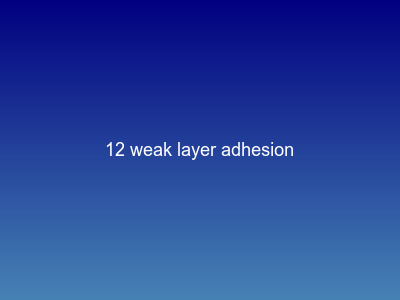 | **PLA** | Reduce part cooling fan to 50% for structural prints | The Bambu A1 cooling fan is extremely powerful. On a structural part with no overhangs, 100% fan freezes the plastic before it can melt into the layer beneath. Lowering to 50% gives layers time to fuse. Keep 100% only when overhangs require it. | 1. Edit PLA **Filament Profile** → Cooling tab  2. Set "Min fan speed" and "Max fan speed" to **50%** for structural prints  3. Keep at 100% if part has significant overhangs  4. Layer height: keep at `≤ 0.28 mm` for better layer overlap  5. Increase nozzle temp by `+5°C` if delamination persists |
| | **PETG** | Check surface finish; if matte, lower volumetric speed or raise temp 5°C | PETG must be printed hot and slow enough for thorough melt. *The Gloss Test:* if your part comes out dull or matte, you outran your hotend. If it comes out shiny and glossy, the layer bonds are nearly indestructible. Matte = insufficient melt time = weak layers. | 1. Inspect the part surface in bright light — matte = too fast, glossy = correct  2. Lower "Max volumetric speed" from default to **`9 mm³/s`** (Filament Profile → first tab, bottom)  3. Or raise nozzle temp by `+5°C`  4. Fan: `≤ 30%` on perimeters  5. Never print PETG cold — `230°C` minimum |
| | **TPU** | Dry the filament for 8 hours; limit volumetric flow to `< 3.5 mm³/s` | TPU absorbs moisture from air in under 2 hours. The water inside the filament boils when it hits the nozzle, creating microscopic steam bubbles inside walls. These bubbles act as perforation lines — the part snaps cleanly along layer boundaries under any stress. | 1. Dry spool at **50–55°C for 8 hours** in a filament dryer before printing  2. Edit TPU **Filament Profile** → first tab, bottom → "Max volumetric speed": **`3.2 mm³/s`**  3. Print immediately after drying; TPU re-absorbs moisture quickly  4. Store in sealed bag with desiccant between sessions  5. Fan: `20–40%` only — full cooling prevents inter-layer bonding |

---

## 13. Over-Extrusion (Blobbing, Dimensional Inaccuracy, Nozzle Scraping, Elephant Foot)

| Example | Material | Mitigation | Reason / Cause | Slicer How To |
|---------|----------|-----------|----------------|---------------|
|  | **PLA** | Calibrate Flow Dynamics (Pressure Advance / K-Factor) | Molten PLA acts like a pressurized fluid. When the print head brakes before a corner, residual pressure keeps squirting plastic out, over-extruding the corner into a blob. Pressure Advance tells the extruder to reverse slightly *before* the corner to kill that pressure spike. | 1. Bambu Studio → **Calibration** tab → run *Flow Dynamics* test  2. Enter resulting K-value (typically `0.020–0.035`) into your device profile  3. Flow calibration: run *Flow Rate* test to verify volumetric accuracy  4. Advanced → Elephant foot compensation: `0.1–0.2 mm`  5. Print a calibration cube first — PA errors show as corner blobs and wall ripples |
| | **PETG** | Lower Flow Ratio (extrusion multiplier) to `0.94–0.95` | PETG expands (die swell) the moment it escapes the nozzle. At a 1.0 flow ratio, overlapping lines squish upward into tiny ridges. On the next layer the nozzle crashes through those ridges, accumulating burnt debris that falls into the print. A slight underflow ratio accounts for die swell. | 1. Edit PETG **Filament Profile** → first tab → "Flow ratio": set to **`0.94`–`0.95`**  2. Calibrate Pressure Advance: PETG K-value is typically `0.04–0.08`  3. Advanced → XY Contour Compensation: `-0.05–0.1 mm` to correct outer dimensions  4. Check for black debris accumulating on print surface — sign of chronic over-extrusion  5. Verify with a calibration square before dimensional prints |
| | **TPU** | Drastically lower Flow Ratio to `0.85–0.90`; uncheck "Ensure vertical shell thickness" | As the extruder pulls TPU off a heavy spool, tension stretches the filament like a rubber band — the diameter thins temporarily at the extruder gears. Inside the melt zone it relaxes and expands back to full volume, causing massive over-extrusion unless the slicer is told to expect less. | 1. Edit TPU **Filament Profile** → Flow Ratio: **`0.88`** (start here, adjust by ±0.03)  2. Process Profile → Strength tab → **uncheck** "Ensure vertical shell thickness"  3. Calibrate with a single-wall vase: measure wall thickness with calipers  4. Elephant foot compensation: `0.2–0.3 mm`  5. Use a lightweight external spool holder to minimize filament tension |

---

## 14. Mesh Pattern Performance Reference

Nozzle-adaptive geometry rules for OpenSCAD mesh patterns. All widths expressed as multiples of extrusion width `L = nozzle_d × 1.05` (0.42 mm at 0.4 mm nozzle).

| Example | Mesh Pattern | Geometry | OpenSCAD Optimization | Speed & Slicer Impact |
|---------|--------------|----------|-----------------------|-----------------------|
| 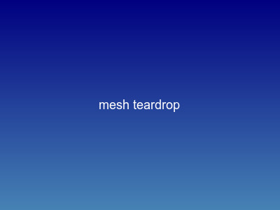 | **Truncated Teardrop** *(Speed King)* | Circle base + 45° triangle roof, tip flattened to exactly 1 × L wide | Roof sides start at the 45° points on the circle (`r*cos(45)`, `r*sin(45)`) — not the base diameter. Tip polygon: `[[-bx, by], [bx, by], [L/2, th], [-L/2, th]]` where `th = r + r*sin(45)`. | Maximum speed. Slicer reads the flat top as a standard single-line bridge — zero Arachne tip pinch, minimal layer-time slowdown. Self-supporting up to 45° overhang with no support needed. |
| 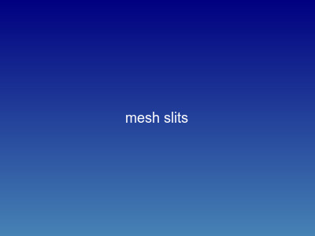 | **Vertical Slits** *(Louver)* | Tall rectangular cutouts running up the Z-axis; pillars between slits are structural columns | Slit width: arbitrary (`1.5–2 mm`). **Pillar width must be `≥ 4 × L = 1.68 mm`** — 4 extrusion passes = 2 solid perimeters each side. Previous `2 × L = 0.84 mm` was only 1 pass per side: structurally weak. | Extremely fast. Zero overhangs, no retractions if slicer uses continuous perimeters. Strong Z-axis load-bearing. |
| 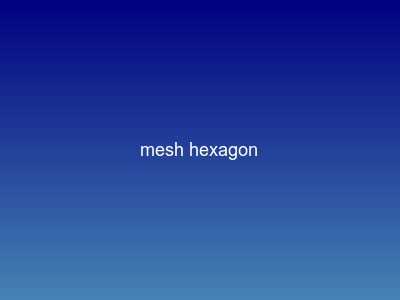 | **Hexagon** *(Honeycomb)* | Tessellated 6-sided polygons. Use `$fn=6` — intentional hexagon, not a circle. | Strut thickness: even multiple of L (target `4 × L = 1.68 mm`). Grid spacing: `[step, step*sin(60)]` with `stagger=true` — geometrically correct for tight hex packing. Y-struts are `sin(60) ≈ 0.866×` of X-struts (inherent hex asymmetry, acceptable). | Medium speed. 30° overhang roof prints cleanly at 0.28 mm layer heights — no support needed. Constant short X/Y direction changes moderate throughput. |
| 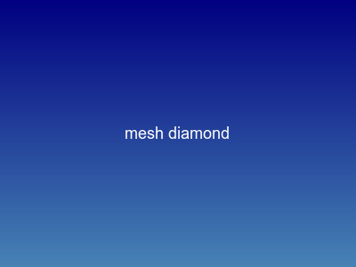 | **Truncated Rhombus** *(Diamond Grid)* | Staggered diamonds with vertical tips flattened to 1 × L | Top/bottom tips: explicit polygon truncation — `corner rounding` does not fix vertical tips, only side corners. Side angles: 45°. Strut thickness: `2 × L = 0.84 mm`. Polygon: 8 points with flat top and bottom segments of width L. | Fast travel, high retraction count. Excellent self-supporting overhangs (45° sides). Hundreds of retractions per layer to jump between isolated diamonds — not ideal for throughput. |
| 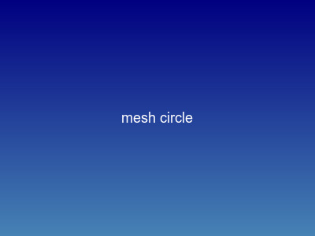 | **Perfect Circle** *(Anti-Pattern)* | Standard cylindrical boolean cutout | Top of circle is a horizontal overhang (0° from horizontal) — requires bridging or sags. Keep diameter `≤ 3 mm` if used. Strut thickness: integer multiple of L. | Extremely slow. Triggers "Small Perimeters" speed reduction. Top 20% of every hole prints mid-air; PETG will sag. Avoid for ventilation mesh — use teardrop instead. |

---

_Last updated: 2026-06-04_
