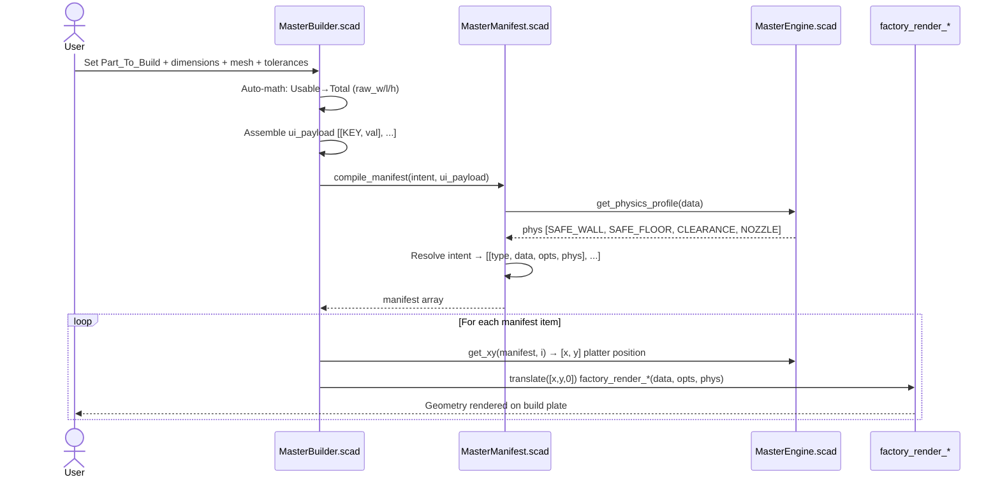
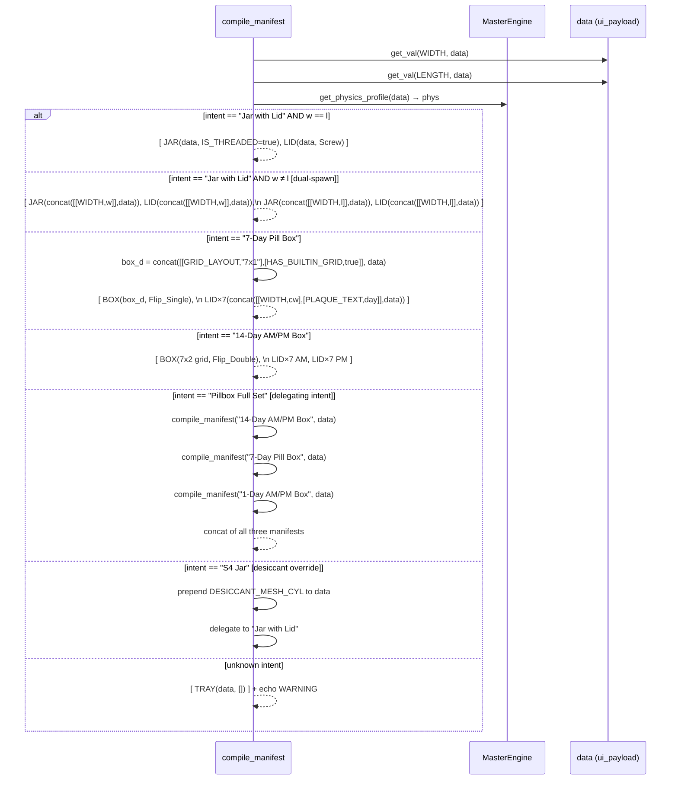
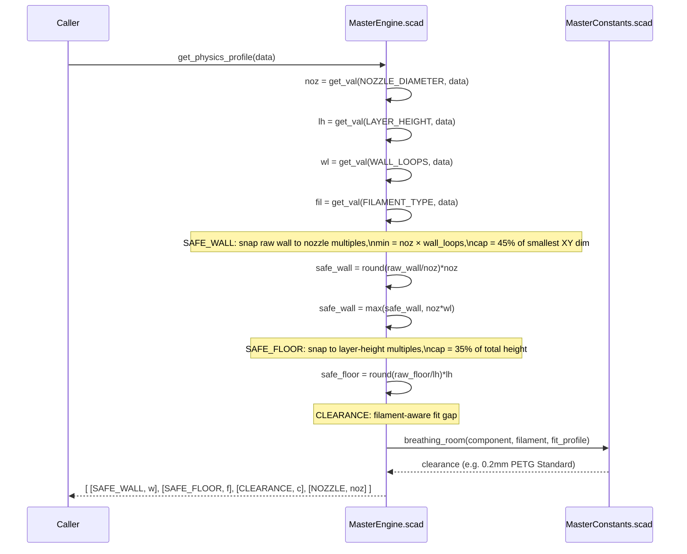
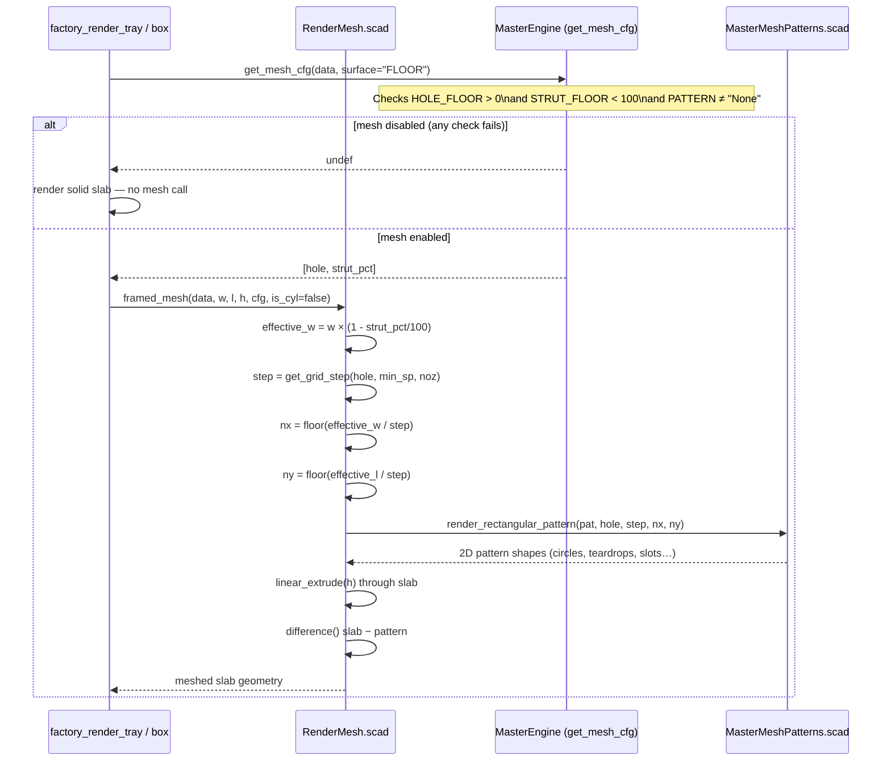
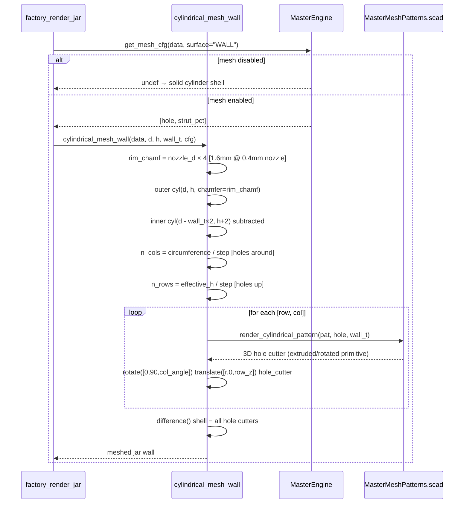
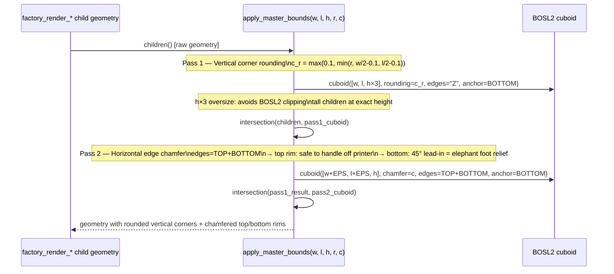
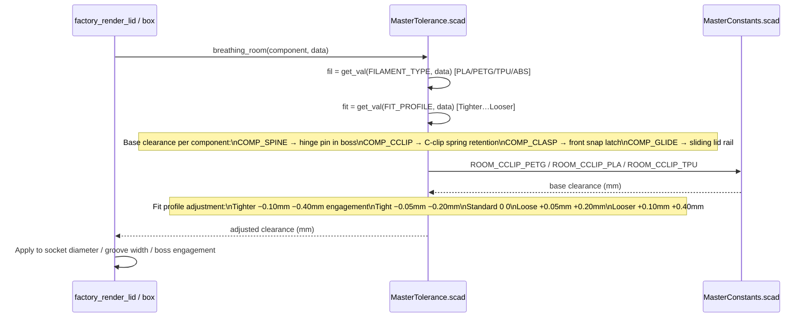
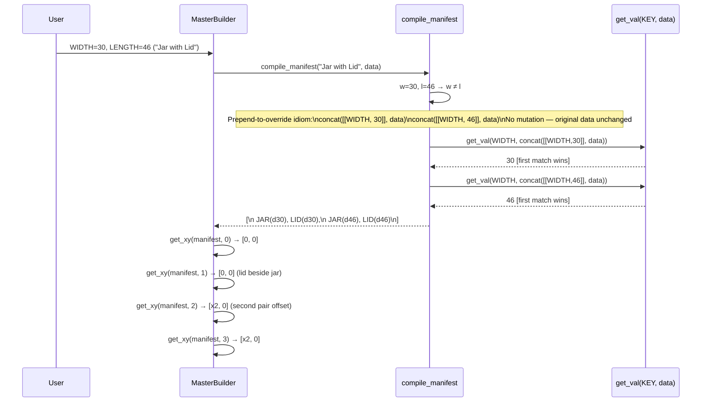
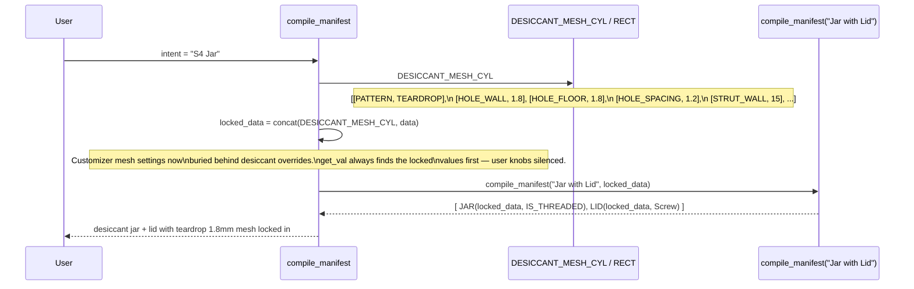
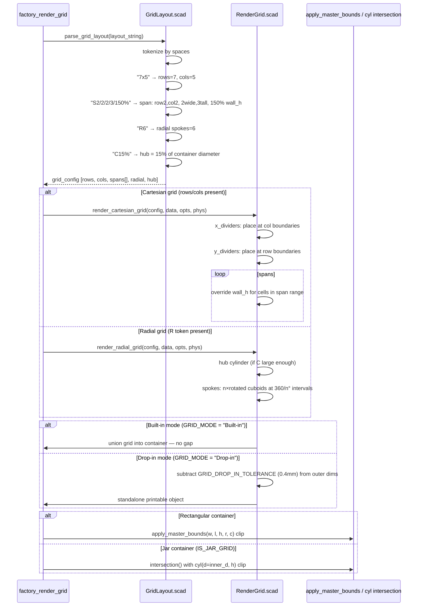

# MasterTray — Sequence Diagrams
_Generated: 2026-06-04_

---

## 1. Top-Level Build Pipeline

The complete path from Customizer input to rendered geometry.

---

## 2. Manifest Compilation — Intent Resolution

How `compile_manifest` maps an intent string to typed component tuples.
Shows the data-override (prepend) pattern that enables dual-spawn and inline config.

---

## 3. Physics Profile Computation

How `get_physics_profile` derives FDM-safe geometry from raw user inputs.

---

## 4. Mesh Rendering — Flat Surface (Box/Tray Floor & Lid)

How `framed_mesh` decides whether to render mesh, and which pattern to use.

---

## 5. Mesh Rendering — Cylindrical Wall (Jar)

---

## 6. apply_master_bounds — Edge Safety (All Rectangular Primitives)

Two-pass intersection that applies corner rounding + top/bottom chamfer.
Every box, tray, lid, and grid passes through this module.

---

## 7. Tolerance & Fit — Clearance Lookup

How fit clearance is derived per joint type, filament, and user fit profile.

---

## 8. Dual-Spawn Pattern — Data-Conditional Manifest

When W ≠ L on a jar intent, the manifest spawns two independent jars each with
their own WIDTH override prepended to data, exploiting `get_val`'s first-match.

---

## 9. Desiccant (S4) Intent — Override Chain

Shows how S4 intents lock mesh settings by prepending constants,
then delegate to a general intent.

---

## 10. Grid Layout — Parse to Geometry

How a layout string like `"7x5 S2/2/2/3/150% R6 C15%"` becomes divider geometry.

